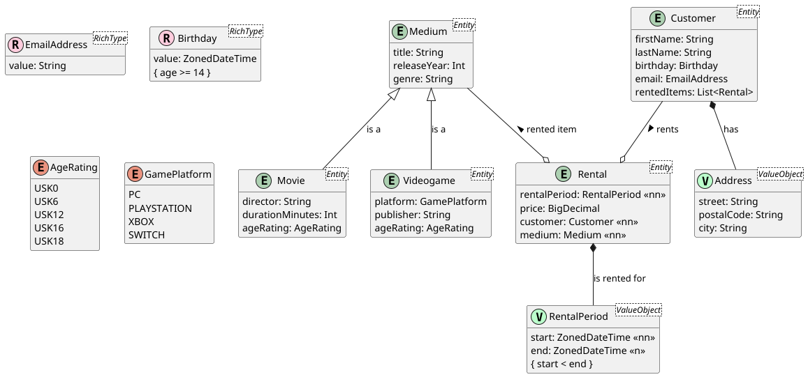

# 4EHIF December Probetest

## Movie Rental Store

Your goal is to develop the **domain** and **repository** layer for a movie rental store service.
Below you find the PUML diagram that describes the entities of this application.

The core use case of this application is that customers can rent movies, video games or some other
not specified media. Because we want to support different types of media, we provide a super class
"Medium" and, via inheritance, add specific subtypes, such as Movie and Videogame.

Each medium that is rented by a customer is represented by "Rental". A rental contains the customer,
the rented medium, a price and a rental period, which consists of a start and end date. Note that the
end date must be **after** the start date.

### Your tasks 

- Properly map all attributes.
- Properly map all relationships and assign appropriate names.
- Use embedded ids for all entities.
- Write converters for the enums and rich types (and apply those converters!).
- Throw exceptions when converters fail to convert some value.
- Use Lombok for convenience to create the necessary constructors, getters and setters.
- Write one repository per entity.
- Test everything! Each builder and repository must have at least one (succeeding) test case.
